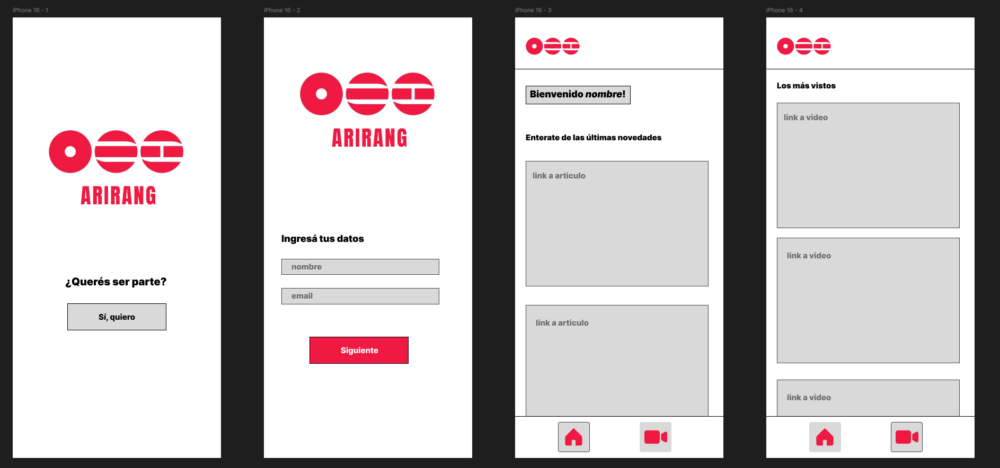

## 🎵 Arirang APP

Este proyecto fue desarrollado como parte de la carrera **Analista en Sistemas** en la **Escuela DaVinci**, dentro de la materia **Aplicaciones móviles**.
Su objetivo fue analizar y desarrollar un sistema de utilizando *Android Studio*.

---

### 🎯 Objetivo del proyecto

Diseñar y desarrollar una **app** que posea un funcionamiento basico.

---

### ✨ Características

- Conexión entre activities
- Carga y muestra de datos del usuario
- Diseño de interfaz  

---

### 🛠️ Tecnologías utilizadas

- **Java**
- **Interfaz con xml**

---

### 🧪 Entorno de ejecución

Proyecto desarrollado y ejecutado en **entorno local**, como aplicación académica, sin fines productivos.

---

### 📌 Estado del proyecto

En progreso.

---

### ✏️ Maquetado

[Ver diseño en Figma](https://www.figma.com/design/a6sNsFXc4HxlhyrpCQTVqx/parcial1Moviles?node-id=0-1&t=AumFHQ43triqwlLd-1)

